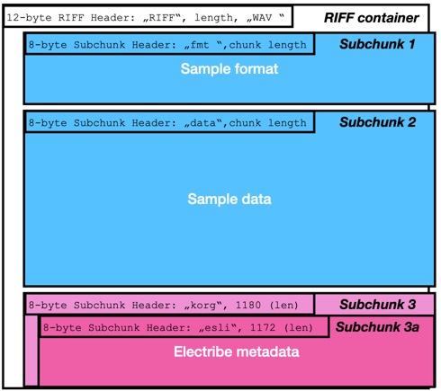

# e2sSample.all file format
The sample dump file contains of these parts: 
- 4096 (0x1000) header bytes
- RIFF file containers, one for each sample - basically Windows .WAV files with some Korg Electribe metadata added

## The e2sSample.all header 
...is pretty straightforward: a 16-byte, null-terminated text string as a file ID, and a map of 32-bit pointers to the individual RIFF files. 
0x00000000-0x0000000F "e2s sample all"0x00
0x00000010-0x00000FAF 1000x4 (0x3E8*4 = 0xFA0) 32-bit pointers to the individual RIFF files; little-endian. 
Anything not needed is filled with 0x00000000. 
**In the original factory samples**, the first 18 oscillators are used for synth wave forms and audio input, so the first sample goes to oscillator 19 - the computer starts counting, so the slot for this osc is #18 (0x12) in hex. Each slot needs 4 bytes for the pointer, so the first non-zero pointer value in the *original factory sample bank* can be found at 0x00000010 + 4*0x12 = 0x00000058. 
**In the Hacktribe sample bank**, only the user sample slots may be used - so the first non-zero pointer should be #500 = 0x1F4 at address 0x00000010 + 4*1F4 = 0x000007E0.
In both cases, the value in this pointer should be 00 10 00 00, i.e. pointing to 0x00001000 - the first memory location after the .all file header. 

## The first RIFF memory block (and all the others just like it)
Each sample is stored in what is basically a Windows WAV file with some Electribe data appended to it. 

The specification for Windows WAV files is called RIFF WAVE. If you start looking up the RIFF format: The [Wikipedia article on RIFF WAVE](https://de.wikipedia.org/wiki/RIFF_WAVE) is quite good (at least the German one). It's an outer container (12 bytes header plus data), and, on a windows machine, 2 inner containers (each with 8 bytes header plus data). The Electribe adds a third inner container with the Electribe metadata like sample name, location, category, and presumably chopping data, and such.

The structure of the first RIFF block in memory is this: 

- **RIFF Container Chunk**
	- 0x00001000 "RIFF" Beginning of first RIFF file
	- 0x00001004 32bit RIFF Chunk length (+0x08 for correct pointer)
	- 0x00001008 "WAVE" IDs type of RIFF file
- **Subchunk 1: Format data**
This subchunk has a fixed length of 24 (0x18) bytes.
	- 0x0000100C "fmt " Subchunk 1 - type
	- 0x00001010: 10 00 00 00 32bit Subchunk length from here (+x08 for header for total chunk length)
	- 0x00001014: 01 00 Sample format tag: 0001 = PCM
	- 0x00001016: 01 00 Number of channels: 0001 = mono
	- 0x00001018: 3A 7D 00 00 Sample rate: (0xBB80 = 48k)
	- 0x0000101C: 74 FA 00 00 Bytes per second 
	- 0x00001020: Block Align
	- 0x00001022: Bits per sample 
- **Subchunk 2: Sample data**
This subchunk is as long as the sample demands. 
	- 0x00001024: "data" Subchunk 2 - type
	- 0x00001028: xx xx xx xx 32bit length of the subchunk from here (+8 for header for total chunk length, +44 0x2C from start of RIFF file)
	- 0x0000102C: data block 
- **Subchunk 3: Korg Metadata**
This subchunk - which just contains sub-subchunk 3a - has a fixed length of 1188 bytes
	- 0x000: "korg" 
	- 0x004: 9C 04 00 00 (chunk length from here is 1180 bytes)
- **Subchunk 3a: Electribe List**
This sub-subchunk - containing the Electribe Sample metadata - has a fixed length of 1180 bytes. 
	- 0x008: "esli" 
	- 0x00C: 94 04 00 00 (chunk length from here is 1172 bytes)
	- 0x010: xx xx 16-bit Osc Slot (starting at zero, so e.g. slot 501 - the first slot for user samples - is 0x1F4)
	- 0x012-0021: Name (16 chars, unused: 00)
	- 0x022: xx xx 16-bit Category (0x0011 = User) 
	- 0x024: Absolute Sample No (seems to be a running number incremented each time a sample is imported)
This is all we need for reordering the samples - more details can be found [in this document on Github](https://gist.github.com/jack126guy/b2d38db0c96ca247ae1ad385e011fd78)  pulled from reverse-engineering the free editors [Oe2SLE](https://github.com/JonathanTaquet/Oe2sSLE)(Python-based), and [e2sedit](http://flosaic.com/e2sEdit/) (Java-based)
----
The end of the subchunks 3/3a is also the end of the RIFF WAF block. The next block starts immediately after that.

To re-order a sample, you have to 
- change the Osc Slot data in the subchunk 3a of the RIFF WAV block
- write a pointer to the beginning of the RIFF WAV block to the location in the map at the beginning of the e2sSample.all header 